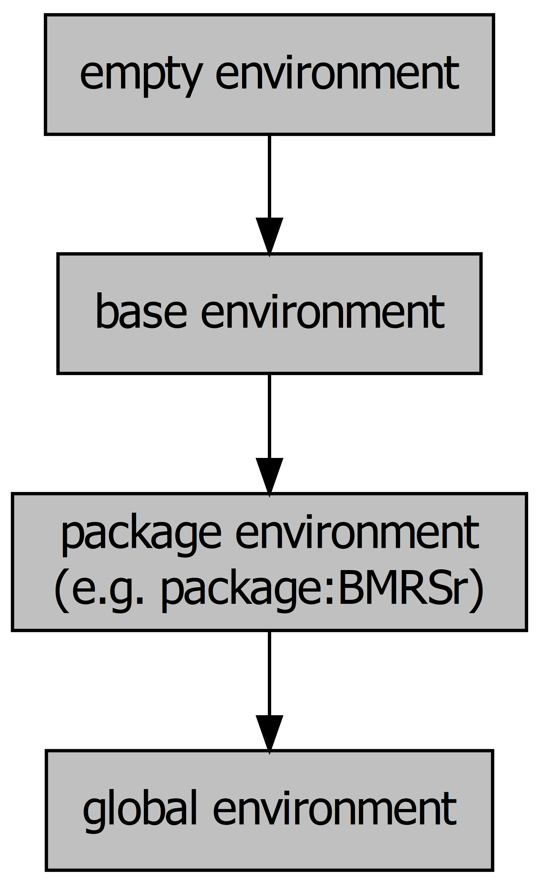

```{r include = FALSE}
if(!knitr:::is_html_output())
{
  options("width"=56)
  knitr::opts_chunk$set(tidy.opts=list(width.cutoff=56, indent = 2), tidy = TRUE)
  knitr::opts_chunk$set(fig.pos = 'H')
}
```


# Environments 

As your scripts become more complex, the number of variables and functions that you assign will start to increase. Pair this with the fact that you may be using lots of external packages that will all contain lots of functions and the number of objects you're working with can easily get into the hundreds and even thousands.

This presents a scoping issue: If I refer to the object `x`, what `x` do I mean if there's more than one? In other words, in which scope should R search for the `x` object?

R uses environments to solve this issue. Environments are collections of objects that can be used to group similar objects and provides a replicable naming convention for retrieving objects that may have the same name from the appropriate environment.

In this chapter, we're going to understand the concepts underpinning environments and scope in R.

## Environment basics

At its core, an environment is a collection of objects. A bit like a list, environments store multiple objects in a single structure.

To create a new environment, we use the `new.env()` function.

```{r}
new_env <- new.env()
```

To add items to our environment, we can add them like we would a list using the `$` operator:

```{r}
new_env$first_object <- "hello"
```

To list all of the objects in an environment, we use the `ls()` function:

```{r}
ls(new_env)
```

Importantly, you can't have two objects in the same environment with the same name. If you try, you'll just overwrite the previous value:

```{r, error = TRUE}
new_env$first_object <- "world"
new_env$first_object
```
### Environment inheritance

Environments have parents and children. In other words, there is a hierarchy of environments, with environments being encapsulated in other environments while also encapsulating other environments.

Every environment (with the exception of what we call the empty environment which is right at the top) has a parent. For example, when I created my `new_env` environment before, this was created in the **global environment**. The global environment is the environment that objects are assigned to when working in R interactively. The global environment's parent environment will be the environment of the last package you loaded. Packages have environments to avoid name conflicts with functions and to help R know where to look for a function. These package environments will contain everything that the package developer included with the package (i.e. functions, maybe some datasets, etc.).

At the top of the environments of packages you've loaded will be the **base environment** which is the environment of base R. Finally, the base environment's parent is the **empty environment** which does not have a parent.


The hierarchy of these environments looks like this:

```{r, echo=FALSE, fig.cap="Environment hierarchy", out.width = "50%", fig.align = "center"}

```

## Scope

So we know that objects in the same environment can't have the same name, but what happens when two different environments happen to have objects with the same name? This is where the concept of **scope** comes in. **Scoping** is the set of rules that governs where R will look for a value.

R will search for the object in order of environment, starting at the most specific environment (so the global environment in the above diagram) and moving up. For example, we know that there is a function in base R called `sum()`. But, if I define a new function in the global environment called `sum` then which function will be called when I type `sum(...)`. Well, because we know that the search path starts from the most specific environment, R will look for `sum` in the global environment first and it'll find the `sum` that I've just defined. At this point, it'll stop looking because `sum` has been found.

For this reason, it's a good idea to use a package like `conflicted` to  manage the packages you loaded, otherwise which function you use when you have two functions with the same name from different packages will be defined by which one you loaded later.

Alternatively, you can specific with which environment R should look for a particular function by prefixing the function with its package and `::`. For example, if I decided against my better judgement to define a function called `sum` in my environment, and then I wanted to call the base function, I could do so like this:

```{r}
base::sum(1,2)
```

## Function environments

Functions, when they are called, create their own more specific environment. The parent of this environment will be the environment in which it was called (most often this will be the global environment).

This breeds some specific behaviours. For example, say you've written a function that expects two input parameters, `x` and `y`. Well, what would happen if someone had already defined an `x` and `y` variable in their script? Which value should R use?

Let's see what happens.

```{r}
sum_custom <- function(x,y) {
  x + y
}

x <- 10
y <- 5

sum_custom(x = 1, y = 2)
```

In this case, the fact that there is already an `x` and `y` in the global environment doesn't really make much difference. The function creates its own more specific environment when it's called, and it looks for the `x` and `y` variables in here first. It finds them and uses those values (1 and 2).

But what happens if a variable doesn't exist in the more specific function environment? Let's take a look.


```{r}
sum_custom <- function(x,y) {
  x + y + w
}

w <- 5

sum_custom(x = 1, y = 2)
```

In this case, the function looks in the specific environment for `w`, but it doesn't exist. The only objects that exist in the function environment are the `x` and `y` that we've provided. So when R doesn't find it in the more specific environment, it looks in the less-specific global environment. It finds it, and so it uses the value it finds.

This can be a dangerous thing, so always make sure that you're function is accessing the values you think it is.

So does R work the other way? Does it ever look in a more specific environment? Nope. 

```{r, error = TRUE}
sum_custom <- function(x,y){
  im_a_sneaky_variable <- 10
  x + y
}

im_a_sneaky_variable
```

Once the function is called, objects in its environment are inaccessible. The long and short of it is, R will start from specific environments and then look upwards, never downwards.

### Mutability

Linked with the idea of function environments is mutability. An object is either mutable or immutable. If it is mutable, then it can be edited from within a function environment. If an object is immutable, then it can't. This might seem like an arbitrary distinction, but it has important consequences. If an object is mutable, then calling the same function on that object twice in a row is going to provide different results (because the object will have changed after the first call). If an object is immutable, then calling the same function on the same object will always return the same value.

In R, values are immutable. In other words, when you pass an object to a function, that function operates on a **copy** of the object you provided - the object is not changed in place.

You can replace the value you passed to the function by assigning it to the returned value:

```{r}
x <- 1
x <- x + 1
```

But this hasn't changed the original value of `x`. It's actually just changed the binded value - you've created a new one and told `x` to be of that value now, you haven't changed the original value.

For the most, this exact distinction isn't too important. The important thing to remember is that when you pass an object to a function, **you are operating on a copy of the object, not the original**.

### 'Super' assignment

There will be occasions, however, when you need to make changes to the global environment regardless of what environment you are currently in. For instance, say you want to increment a counter every time a function is called, regardless of where it's called from. In these cases, you can use the `<<-` operator. This is used as an assignment operator to assign a value to the global environment. Observe...


```{r}
sum_custom <- function(x,y) {
  count <<- count + 1
  x + y
}

count <- 0

sum_custom(1,2)

count

sum_custom(2,3)

count
```
Note how when we assign `0` to our `count` variable outside of the function, we don't need to use `<<-`. This is because we're already assigning to the global environment.

More specifically, the `<<-` operator will search through the parent environments for the variable that its assigning. If it finds the variable in one of these environments, then it will replace the existing definition with the one specified via the `<<-`. Let's do a quick example to show how that works:

```{r}
overwrite_me <- 10
parent_env <- new.env()
parent_env$overwrite_me <- 1

child_env <- new.env()
parent.env(child_env) <- parent_env

overwrite_function  <- function() {
  overwrite_me <<- overwrite_me + 1  
}
environment(overwrite_function) <- child_env

```


Here we've first created a variable in the global environment called `overwrite_me` with a value of 10. Then we've created a new environment that will be a child of the global environment called `parent_env`. We've assigned a variable called `overwrite_me` in that environment with a value of 1. We've then created a new child environment called `child_env` and we've set that environment to be a child environment of `parent_env`. Finally we've created a function called `overwrite_function` and set the enclosing environment (its path for finding values) to the `child_env`.

Now, when I call my `overwrite_function` from the `child_env`, it will look in its parent environments for a variable called `overwrite_me`. Because that variable exists in the immediate parent environment `parent_env`, it will reassign that variable in that environment to the new value. Because it found the variable in its first parent environment, it won't keep looking and so the variable of the same name that we assigned in the global environment will be untouched.

```{r}
do.call(overwrite_function, args = list(), envir = child_env)
overwrite_me # This will still be 10
parent_env$overwrite_me # This will have changed
```
If `overwrite_me` didn't exist in either environment, then it would have been assigned to the global environment - although in this case, the function would have failed because there wouldn't have been a `overwrite_me` value to add to in the first place.

The takeaway - use the `<<-` with care and only assign something to the global environment if you really need to. Otherwise, you may start overwriting variables in other environments without ever realising it.

## Questions {#questions-environments}

1. In what situations can we have two environments with the same name? Why is this?
2. Search 'namespacing'. How does that concept relate to environments?
    + Hint: This is heavily related to question 1
3. What might be an issue with create a function that uses superassignment on an object with the name `x`?
