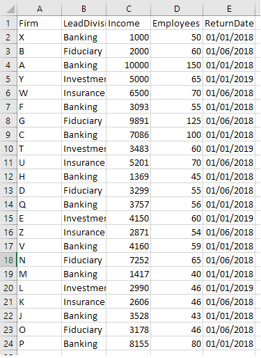
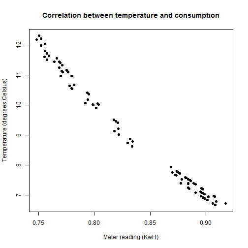
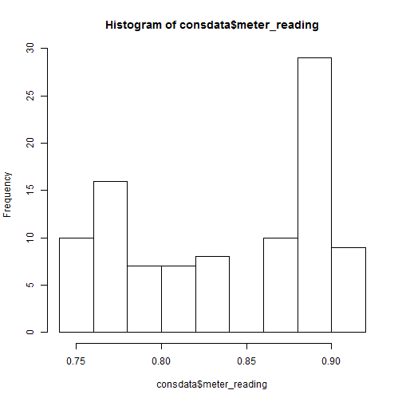

Data Analysis in R
========================================================
author: Adam Rawles
date: 
autosize: true
incremental: true
css: H:/R/Training/r_training.css


Recap
========================================================

- What is R and RStudio?
- Basic arithmetic operators
- Variable assigment
- Data types
- Data structures (including subsetting)
- Functions

Overview
========================================================

- Installing packages
- Loading data
- Cleaning data
- Summary statistics
- Graphs and plots


Installing packages
========================================================

- Installing packages with RStudio is easy to do
- RStudio has a built-in interface for installing packages...
- Or, you can use the R function "install.packages()", and provide the name of the package(s) you want to install to the function


```r
install.packages("ggplot2")
install.packages(c("ggplot2", "dplyr"))
```


- Packages must be loaded before they are available, via the library() function


```r
library(ggplot2)
```

- Note: if you close RStudio, you'll need to reload your packages

Loading data
========================================================

- Data can be loaded into R in many formats
- The easiest of which are .xlsx or .csv files
- These can be loaded into R two different ways
    - The first is by using the read.csv()/read.xlsx() functions
        - The read.csv() function takes a string of the file's path as it's only required input argument
            - But there are a number of optional arguments (e.g. header, stringsAsFactor,...)
        - The read.xlsx() function requires both a path, and the index of the sheet you want from the workbook
        
        
Loading data
========================================================

- The second is to use RStudio's built in "Import Dataset" interface
    - This interface essentially just acts as a wrapper to the read.csv()/xlsx() functions

Loading data - example
========================================================

<div align="center">

</div>

Loading data - example
========================================================
class: small-code


```r
consdata <- read.csv("H://R/Training/Modules/2_Data_analysis/cons_data.csv", header = TRUE, stringsAsFactors = TRUE)

head(consdata, n = 2)
```

```
  settlement_date settlement_period metered_entity_type metered_entity
1      01/01/2018                 1                MPAN       testmpan
2      01/01/2018                 2                MPAN       testmpan
  meter_reading actual_estimate avg_temperature_c
1        0.8889               E              7.40
2        0.8899               E              7.38
```


Loading data - exercise
========================================================
class: small-code

- Using RStudio's "Import Dataset" or the read.csv() function, load the cons_data dataset

Data cleaning
========================================================

- After the data is loaded into R, we need to make sure that each column is in the correct format (e.g. character, factor, numeric, etc.)
- This can be done two different ways:
    - You can either click on the dataframe in the Environment pane, which will open the dataframe in the Source pane
        - From here, you can hover over the column headers to see what type the data is stored as
    - Or, you can use the is.xxxxx functions to check from the console.
        - To do this, you choose the appropriate function for the type you want (e.g. is.numeric()), and include the column you want to check as an argument
        
Data cleaning
========================================================


```r
is.numeric(consdata$meter_reading) ## we could also do is.numeric(consdata[,1]) as per our last session on subsetting
```

```
[1] TRUE
```

```r
is.numeric(consdata$actual_estimate)
```

```
[1] FALSE
```

```r
is.factor(consdata$actual_estimate)
```

```
[1] TRUE
```

Data cleaning
========================================================

- If you want to get the type of a column without comparing it to other types, you use the is() function
- The first value returned from this function will tell you the data type of the column


```r
is(consdata$meter_reading)
```

```
[1] "numeric" "vector" 
```

```r
is(consdata$actual_estimate)
```

```
[1] "factor"              "integer"             "oldClass"           
[4] "numeric"             "vector"              "data.frameRowLabels"
```


Data cleaning
========================================================

- If a column does not have the correct type, we can easily coerce the values into the type that we want
- The exact method is different depending on what you are converting from and to
- Generally speaking however, the method for converting a column type is:


```r
dataframe$column <- as.xxxxx(dataframe$column)
```


Data cleaning - exercise
========================================================

- Convert the meter reading column into a character, check that it's been converted, and then convert it back to numeric


```r
consdata$meter_reading <- as.character(consdata$meter_reading)

is.character(consdata$meter_reading)
```

```
[1] TRUE
```

```r
consdata$meter_reading <- as.numeric(consdata$meter_reading)
```


Data cleaning
========================================================

- This method works well for:
    - Numeric/integer to character
    - Character to numeric/integer
    - Integer to numeric
    - Numeric to integer
    - Character to factor
    - Factor to character
    - Numeric to factor
- For factor to numeric, there's an extra step:
    - Before the factors levels can be converted, they need to be converted to characters first:


```r
dataframe$column <- as.numeric(as.character(dataframe$column))
```

Data cleaning - dates
========================================================

- Dates in R can be tricky
    - R will not import date values in as dates unless you specify that it should
        - But RStudio's "Import Dataset" feature can be pretty handy here...
    - If you don't, R will import them as characters (which means they'll be converted to factors unless you specify stringsAsFactors = FALSE)
- To convert a character to a date, use the as.Date() function...

Data cleaning - dates (example)
========================================================


```r
datetest <- "12/12/2018"
datetest <- as.Date(datetest, format = "%d/%m/%Y")
is(datetest)
```

```
[1] "Date"     "oldClass"
```

- To convert from a factor to a date, first convert to a character...

Data cleaning - dates (exercise)
========================================================

- Our consdata$settlement_date column is currently a factor, convert it to date
- Remeber to convert the column to character first!


```r
consdata$settlement_date <- as.character(consdata$settlement_date)
consdata$settlement_date <- as.Date(consdata$settlement_date, format = "%d/%m/%Y")
```


```r
consdata$settlement_date <- as.Date(as.character(consdata$settlement_date), format = "%d/%m/%Y")
```


Data cleaning - dates 
========================================================

- Dates can also come in numeric form, calculated as the number of days from a particular origin
- For example, a numeric value of 1, with an origin of 12/12/2018 would correspond to a date value of 13/12/2018
- If your date values are in numeric format, you need to specify the origin in the as.Date() function...

Data cleaning - dates (example)
========================================================


```r
datetest <- 17940
datetest <- as.Date(datetest, origin = as.Date("01/01/1970", format = "%d/%m/%Y"))
datetest
```

```
[1] "2019-02-13"
```


Data cleaning - dates
========================================================

- With dates, always specify the format (format codes can be found online and are included in your help sheet)
- There's no is.Date() function in base R
- So to check whether a value is a date, use is()


Data cleaning - conclusion
========================================================

- To find out the type of a column, use the is() function
- Otherwise, you can (usually) test if a column is a specific type via the is.xxxxx functions
- Converting between datatypes (except from numeric -> factor) is easy with the as.xxxxx functions
- When converting numbers to factors, convert them to characters first
- When converting from characters or numeric to dates, as.Date() requires "format" or "origin" parameters respectively 

Summary statistics
========================================================

- Before doing any in-depth analysis, it's always a good idea to get some descriptive statistics from your data
- This includes the mean, the median, the standard deviation, and the interquartile range, but the statistics you use will depend on your data
- Getting these values for each column is easy using the built-in functions R provides:


```r
mean()
median()
sd()
quantile()
```

Summary statistics - exercise
========================================================
class: small-code

- Find the mean, median, standard deviation, and quantiles for our meter reading column


```r
mean(consdata$meter_reading)
```

```
[1] 0.8383583
```

```r
median(consdata$meter_reading)
```

```
[1] 0.85145
```

```r
sd(consdata$meter_reading)
```

```
[1] 0.05566309
```

```r
quantile(consdata$meter_reading)
```

```
     0%     25%     50%     75%    100% 
0.74840 0.77970 0.85145 0.88915 0.91740 
```

Summary statistics
========================================================
class: small-code

- More often than not however, you'll want summary statistics for more than one column, or maybe broken down by group
- R includes a function that will give you summary statistics for each column (the summary() function):


```r
summary(consdata)
```

```
 settlement_date      settlement_period metered_entity_type
 Min.   :2018-01-01   Min.   : 1.00     MPAN:96            
 1st Qu.:2018-01-01   1st Qu.:12.75                        
 Median :2018-03-22   Median :24.50                        
 Mean   :2018-03-22   Mean   :24.50                        
 3rd Qu.:2018-06-10   3rd Qu.:36.25                        
 Max.   :2018-06-10   Max.   :48.00                        
  metered_entity meter_reading    actual_estimate avg_temperature_c
 testmpan:96     Min.   :0.7484   A:48            Min.   : 6.670   
                 1st Qu.:0.7797   E:48            1st Qu.: 7.338   
                 Median :0.8515                   Median : 8.280   
                 Mean   :0.8384                   Mean   : 8.929   
                 3rd Qu.:0.8891                   3rd Qu.:10.640   
                 Max.   :0.9174                   Max.   :12.300   
```

Summary statistics by group
========================================================


- Summary statistics by group are a little bit more complicated as they require the "psych" package
- Once the "psych" package is installed, you can use the describeBy() function to give you summary statistics for each level of a factor in your dataset:
- Note: You'll likely get some error messages if one of your columns isn't numeric, but you can ignore them


```r
describeBy(consdata, consdata$actual_estimate)
```

Summary statistics by group - exercise
========================================================

- Install the "psych" package
- Produce summary statistics by Settlement Date

Summary statistics by group - answer
========================================================


```r
install.packages("psych")
```


```r
library(psych)
describeBy(consdata, consdata$settlement_date)
```


Summary statistics by group
========================================================
class: super-small-code


```

 Descriptive statistics by group 
group: A
                     vars  n  mean    sd median trimmed   mad  min   max
settlement_date         1 48   NaN    NA     NA     NaN    NA  Inf  -Inf
settlement_period       2 48 24.50 14.00  24.50   24.50 17.79 1.00 48.00
metered_entity_type*    3 48  1.00  0.00   1.00    1.00  0.00 1.00  1.00
metered_entity*         4 48  1.00  0.00   1.00    1.00  0.00 1.00  1.00
meter_reading           5 48  0.79  0.03   0.78    0.79  0.03 0.75  0.83
actual_estimate*        6 48  1.00  0.00   1.00    1.00  0.00 1.00  1.00
avg_temperature_c       7 48 10.58  1.06  10.65   10.60  1.16 8.63 12.30
                     range  skew kurtosis   se
settlement_date       -Inf    NA       NA   NA
settlement_period    47.00  0.00    -1.28 2.02
metered_entity_type*  0.00   NaN      NaN 0.00
metered_entity*       0.00   NaN      NaN 0.00
meter_reading         0.09  0.34    -1.24 0.00
actual_estimate*      0.00   NaN      NaN 0.00
avg_temperature_c     3.67 -0.22    -1.17 0.15
-------------------------------------------------------- 
group: E
                     vars  n  mean    sd median trimmed   mad  min   max
settlement_date         1 48   NaN    NA     NA     NaN    NA  Inf  -Inf
settlement_period       2 48 24.50 14.00  24.50   24.50 17.79 1.00 48.00
metered_entity_type*    3 48  1.00  0.00   1.00    1.00  0.00 1.00  1.00
metered_entity*         4 48  1.00  0.00   1.00    1.00  0.00 1.00  1.00
meter_reading           5 48  0.89  0.01   0.89    0.89  0.01 0.87  0.92
actual_estimate*        6 48  2.00  0.00   2.00    2.00  0.00 2.00  2.00
avg_temperature_c       7 48  7.28  0.33   7.30    7.28  0.41 6.67  7.93
                     range  skew kurtosis   se
settlement_date       -Inf    NA       NA   NA
settlement_period    47.00  0.00    -1.28 2.02
metered_entity_type*  0.00   NaN      NaN 0.00
metered_entity*       0.00   NaN      NaN 0.00
meter_reading         0.05  0.14    -0.82 0.00
actual_estimate*      0.00   NaN      NaN 0.00
avg_temperature_c     1.26 -0.03    -1.17 0.05
```


Summary statistics - conclusion
========================================================

- Producing summary statistics for columns in a dataframe can be done through the mean(), median(), sd(), and quartile() functions
- Producing summary statistics for multiple columns can be done with the summary() function
- Producing summary statistics by group requires the "psych" package, and the describeBy() function


Plotting
========================================================

- After calculating your summary statistics, it can be useful to visualise the data to better understand any trends or differences
- For example, we may want to see if there's a difference between the meter reading values for estimates vs. actuals
- We could use a plot to visualise that difference
- There are two good ways to create plots
    - The first uses R's built-in plotting functions
    - The second uses a package called "ggplot2"

Plotting
========================================================

- R's main plotting function is plot()
- This function takes the data you want to visualise as it's only required argument, with optional arguments to specify what kind of plot you want
- If you don't specify what kind of plot you want, plot() tries to guess the most appropriate type of plot for your data, and creates it

Plotting - example
========================================================

- First off, let's plot the meter reading values of estimates and actuals to see if there's a difference:


```r
plot(x = consdata$actual_estimate, y = consdata$meter_reading)
```

Plotting - example
========================================================


- As you can see, we've specified our x and y axis, but not what type of plot we want
- But the plot() function has guessed that we probably want a boxplot
- Note: you can also force R to create a boxplot using the boxplot() function

Plotting - example
========================================================

- Next, we might want to see if there's a correlation between the meter reading and the temperature
- Again, we can use the plot function, specify our x and y axis, and R will guess what the best plot is


```r
plot(x = consdata$meter_reading, y = consdata$avg_temperature_c)
```

Plotting - example
========================================================


- R has created a scatter plot by default, but we can change the type if we wish using the option "type" argument
- See your help sheet for the different types

Plotting - exercise
========================================================

- Create a plot of meter readings against Settlement Periods...


Plotting - answer
========================================================


```r
plot(x = consdata$settlement_period, y = consdata$meter_reading)
```


Histograms - example
========================================================

- One of the best features of the plotting system in R is how easy it is to make histograms
- You can either use the plot() function and specify "h" as the type, or we can use the hist() function and provide one variable to produce a simple histogram...


```r
hist(consdata$meter_reading)
```

Histograms - example
========================================================


Customizing your graphs
========================================================

- To make your graph easier to understand, you may want to...
    - Change the title
    - Change the axis labels
    - Change the points
    - Change the size of the bins for our histogram
- Note: These are a few of the customization options, but there are many, many more

Customizing your graphs
========================================================

- Change the title
    - To change the title, all we need to do is specify a "main" parameter in our plot function...
    

```r
plot(consdata$meter_reading, consdata$avg_temperature_c, main = "Correlation between temperature and consumption")
```

- Change the axis labels
    - To change the labels on the axes, we use the "xlab"/"ylab"" parameters...


```r
plot(consdata$meter_reading, consdata$avg_temperature_c, main = "Correlation between temperature and consumption", xlab = "Meter reading (KwH)", ylab = "Temperature (degrees Celsius)")
```


Customizing your graphs
========================================================

- Changing the graph points
    - To change the points, we use the "pch" paremeter, and specify a value between 0 and 25...


```r
plot(consdata$meter_reading, consdata$avg_temperature_c, main = "Correlation between temperature and consumption", xlab = "Meter reading (KwH)", ylab = "Temperature (degress Celsius)", pch = 19)
```

- Putting those all together...

Customizing your graphs
========================================================



Customizing your graphs (histograms)
========================================================

- In addition to the previous customization options, for histograms, we can change the size of the bins
    - To do this, we specify the "breaks" parameter in our hist() function
    - This splits up out our data into x number of bins of equal size
    

```r
hist(consdata$meter_reading, breaks = 30)
```

Customizing your graphs (histograms)
========================================================



Plotting - final exercise
========================================================

- Create a plot of your choice, and change the title and axis labels.

Plotting - conclusion
========================================================

- In short, R has lots of in-built tools to make quick, simple graphs and plots
- Most types of graph only require a few input parameters, but there's lots of customization options
- In a later module, we'll look at a package called ggplot2, which we'll use to create more complex and professional graphics

Conclusion
========================================================

- Installing packages
    - install.packages(), library()
- Loading data
    - read.csv()/read.xlsx()
- Cleaning data
    - Data type checks
    - Data type conversion
        - Look out for dates and factors!
- Plotting
    - plot()/hist()
- Customization
    - "main", "xlab", "ylab", "pch", "breaks"
- Next time...
    - Creating functions
    - For loops
    - If else statements
