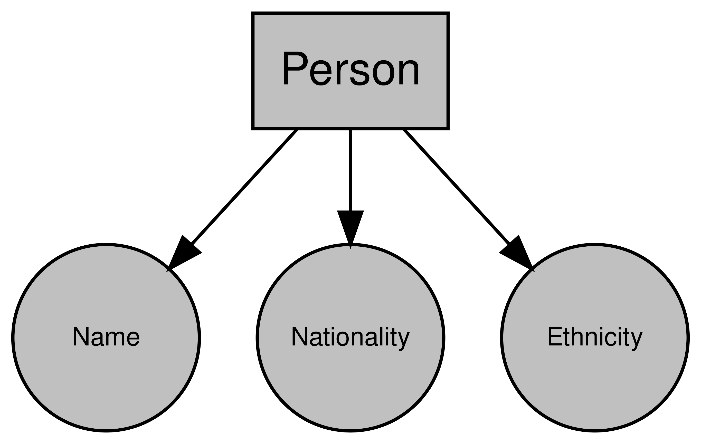

# Objects and Classes

Objects and classes are a fairly ubiquitous concept across programming languages and data analysis tools. We'll briefly look at what an object is in R, but by no means is this an exhaustive description.

## What is a class?

The world is complicated. Everything in the world is unique and defined by an infinite number of properties and features. For example, if you take a person, they can be defined by their name, where they're from, where their parents are from, their hair colour, their likes and dislikes, and so on and so on. When we want to store data in a structured and formal way in a computer system, however, this isn't particularly helpful. Instead, we need to store data in a predefined structure. This is essentially what an class is; a pre-defined structure to store important attributes or features of a **thing**.

Let's take the person instance again. Let's say we're going to store data on a number of individuals, we won't be able to store everything about them. So we'll choose a subset of their attributes or features to store that are relevant to what we need. But to make things more efficient, we're going to store the same information for each one. So lets say we're going to do some geographical analysis, we might want to include a person's name, their nationality, and perhaps their ethnicity. So for each person we want to store, we can store these three attributes. And we might call this data structure a "person". Well this is exactly what an class is; a collection of attributes and features that is shared objects instances of the same type.

So our class is "person", and it has the attributes "name", "nationality", and "ethnicity". Now this obviously doesn't capture everything about a person, but it's enough for what we want to do.

Graphing that object might look something like this:

```{r echo=FALSE, fig.cap="Example `Person` object", out.width = "50%", fig.align = "center"}

```

## What is an object?

An object is just an instance of a class. So if you create a person from our "person" called John, then "John" is the object an "person" is the class.

When you create a dataframe for example, you're creating a `data.frame` object from the basic structure of the `data.frame` class.

## Objects and Classes in R

Looking more specifically at R, what kind of objects do we see. Well, according to John Chambers, the founder of the S programming language upon which R is based, everything is:
  
  > "To understand computations in R, two slogans are helpful:   
>
>  *  Everything that exists is an object.
>  *  Everything that happens is a function call.
>
> --- John Chambers"

So every function, dataframe, plot, list, vector, integer, everything is an object.

To see the class of an object in R, use the `class()` function.

```{r}
class(data.frame()) # here we're finding the class of an empty data.frame
class(data.frame) # here we're finding the class of the data.frame() function
class(1)
```

### Inheritance

Sometimes, different classes are interrelated. For example, if you were storing data on vehicle, then you might have a "vehicle" class. But if you're storing data on lots of different vehicles, you might also have classes for each type of vehicle (e.g. "car", "motorbike", etc.). All of these classes are still vehicles, and so you don't want to have to repeat yourself when you define each of those classes. In other words, all of those classes are going to have some common attributes like colour, horsepower and so on. Similarly, each different type of vehicle will have some attributes that are unique to that type of vehicle. For instance, motorbikes can have sidecars but vans and cars don't. Cars and vans have doors but motorbikes don't. This highlights the benefits of inheritance. By creating a "vehicle" class and allowing your subsequent classes to inherit all of the attributes of the "vehicle" class, you can avoid duplication while allowing distinct classes. This way, when you want to add any attributes to all of your vehicles, you can just do it via the "vehicle" class rather than changing each type of vehicle class.

Diagramming this relationship:
  
  ```{r echo=FALSE, fig.cap="Example of inheritance using cars", out.width = "50%", fig.align = "center"}
knitr::include_graphics("./diagrams/inheritance_cars.png")
```

Inheritance is an extremely deep topic which we won't go into here, but R objects also use inheritance. To see the inheritance tree of an object, use the `is()` function:

```{r}
is(1L)
```
Diagramming this like our "vehicle" example would look like this:

```{r echo=FALSE, fig.cap="Inheritance of the integer class", out.width = "20%", fig.align = "center"}
knitr::include_graphics("./diagrams/inheritance_numeric.png")
```

Here we can see that an integer object is made up of the integer, double, numeric classes. The order of inheritance goes from left to right so we know that the integer class inherits from the double class, which inherits from the numeric class.

### Object-Oriented Systems

Unfortunately (or fortunately, depending on your point of view), R doesn't have a single way of storing objects. In fact, there are 2 object-oriented (OO) programming systems in base R, and more (like R6) can be added via packages. These two base OO systems are S3 and S4, and they differ in the way that objects are constructed, stored, and interacted with. We're not going to go into the difference here, but I recommend Hadley's [Advanced R](https://adv-r.hadley.nz/) to better understand the difference between the two. For now, I'm just going to explain the basics of the S3 system as I think it's the easiest to understand and helps convey the philosophy behind why we use objects more easily.

#### S3

In the S3 system, we rely on generic functions and methods. Generics are functions that have a single common goal, but that can be used for objects that might be very different. For example, `print()`-ing a dataframe is going to be different to `print()`-ing a plot or an API response or whatever. But `print()` always seems to know what to do. The reason it does is that the `print()` function is a **generic** function that actually uses a more specific function to achieve it's goal. In other words, we achieve a fairly high level goal like printing by calling a function that is specific to the object we're working on under the hood. These more specific functions are called **methods**.

As a real world analogy, think of the process of talking to someone. The common goal in talking is to communicate. But, depending on the language that someone speaks, the actual act of talking is going to be slightly different for different people you talk to. In this case, you can think of **communicating** as being the **generic** - it's the eventual goal. And **talking in the appropriate language** as being the **method**.

Going back to R, if you type `print.` into the console, the autocompleter will show you lots and lots of `print.something()` functions. These are all of the **methods** for all of the different printable objects in R. `print.date()` will print a date object, `print.data.frame()` will print a dataframe object and so on. But when you just use the `print()` function on an object, R will automatically choose which method it needs for the object you've passed as an input parameter. If there isn't a specific method for the object you've provided, then it will use the default `print.default()` method.

```{r}
# here we're using the generic
print(as.Date("2020/06/10")) 
# because we're printing a Date object,
# this is the method that is actually used
print.Date(as.Date("2020/06/10"))
```
If an object inherits multiple classes, then R will look for the correct method starting from it's most specific class. So for example, if an object has classes `c("class_1", "class_2")`, then R would look for `print.class_1()` and only look for `print.class_2()` (and then `print.default()`) if it couldn't find `print.class_1()`.

While you can often tell if something is an S3 method by it being a generic followed by a `.` and then an object name, don't rely on this, because people often use `.` to separate words in functions that can make them look like S3 methods when they're not. 

**Note:** In some languages, methods are essentially functions or sub-routines that are tied to an class. For instance, a class that represents a person's bank account might have the method `Balance()`, which will return how much money a person has in their account. There are certainly some similarities between how methods are used in R and some other languages, they are a bit different. Mainly, in R, methods are not attributes of a class but are separate functions.

## Creating classes

The obvious question is "Can I make my own class in R?". The answer is yes. And quite easily too. Whether you should or not is a different story. We're just going to look very briefly at creating a class in using S3 for now, but I'd recommend Hadley's [Advanced R](http://adv-r.had.co.nz/) for a deeper look at the different systems and how to use them.

### Class attribute

In S3, the class of an object is defined by its `class` attribute, which stores a vector of class names. To see an object's class, we use the `class()` function:

```{r}
class(1)
class(TRUE)
```
This class attribute will determine what method is dispatched when we call a generic on this object. So here, if we called `print()` on `1`, then it would look for `print.numeric()` and dispatch that method to print the object. Technically, this just calls `print.default()` because the default method knows how to print numeric values but the logic remains.

Something which will make OO programmers everywhere cringe, is that the class attribute for an R object is modifiable:

```{r}
var_1 <- 1
class(var_1) <- "custom_class"
class(var_1)
```
Now, when we attempt to print the `var_1` variable, R will look for the appropriate method based on it's class (`custom_class`), which would be `print.custom_class()`. In this case, a `print.custom_class` method doesn't exist, so it'll default to the `print.default()` method:
  
  ```{r}
print(var_1)
```

Importantly, we've learnt here that setting the class of an object is as easy as using the `class()` function and the `<-` operator.


### Constructor functions

To ensure our objects in the same class all have a similar structure, we want to make a constructor function that requires certain values. For example, let's create a class to store addresses, and we'll say that we need the house name, the road and the city. Our constructor function might look like this:


```{r}
address <- function(house_name, road, city) {
  address <- list(
    house_name = house_name,
    road = road,
    city = city
    )
  class(address) <- "address"
  return(address)
}
```
Now to create an object from my constructor function, I just need to use the `address()` function:

```{r}
my_address <- address("4", "Pleasant Drive", "London")
class(my_address)
```

Now, if I called `print(my_address)`, R would look for a `print.address()` method. But, it wouldn't find one and so would turn to `print.default()` which would print our object like any other list. Therefore, we might want to write our own method to print our new object how we want to.

### Creating methods

To create a method, all we need to do is create a function with the name of our generic followed by a '.' and then name of our class. So from our previous example, our method would look like this:
  ```{r}
print.address <- function(address) {
  cat("The house name is: ", address$house_name, "\n")
  cat("The road is: ", address$road, "\n")
  cat("The city is: ", address$city, "\n")
}
```

Now when we call `print()` on our new object, it will find the `print.address()` method and use that to print our object:
  ```{r}
print(my_address)
```

### Creating generics

You can also create your own generic functions for your classes. Generic functions have a very simple structure. Let's say we want to create a new generic called `post`:

```{r}
post <- function(x) {
  UseMethod("post")
}
```
This is just telling R that when the `post()` function is called on an object, look for the appropriate `post` method to use. Without us writing any methods, this would be useless because R wouldn't have any methods to use!
  
  Let's create a default method that can be applied if we don't have a more specific class:
  
  ```{r}
post.default <- function(x){
  cat("Your object is now in the post! Expect it in 5 to 10 weeks")
}
```
In our example, this default method isn't going to be very useful but it demonstrates that we need a default method to be dispatched if we haven't written a specific method for that object class.

Let's write a method for our `address` object:
```{r}
post.address <- function(x) {
  cat("Your object has been posted to ", x$house_name, " ", x$road, " ", x$city, "!")
}
```

Now, if we call our new generic on two different classes of object and compare:

```{r}
post(1)
post(my_address)
```
We can see that in the top example, `post()` has dispatched the `post.default()` method. In the second example though, it's dispatched the `post.address()` method.

As you can see, the S3 system is quick and easy. For smaller projects, this should be more than enough to get you by. Because it's quick and easy though, it's not particularly sturdy. You can change the class of any object, which will change the methods that are called on it and so can really mess things up. If you're careful though, creating custom objects in your projects can be very powerful.

## Questions {#questions-objects-and-classes}

1. Why does `is(1L)` return integer, then double, then numeric in that order?
2. Now we understand inheritance, why can dataframes be subsetted with a `$`?
3. If we create a dataframe and then call `print.default()` on it, why do we get the output that we do? Why does it look more like a list than a dataframe?
4. Why are constructors not a fool-proof way of making sure that all our objects of our class will have the same structure? How else might one create an object of class `address`?
5. `methods("mean")` returns methods for dates and datetimes, but no other object. Why is this? What does this mean when constructing methods for a new generic?
