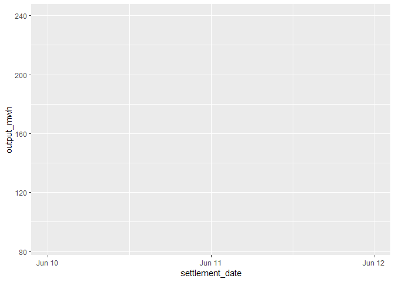
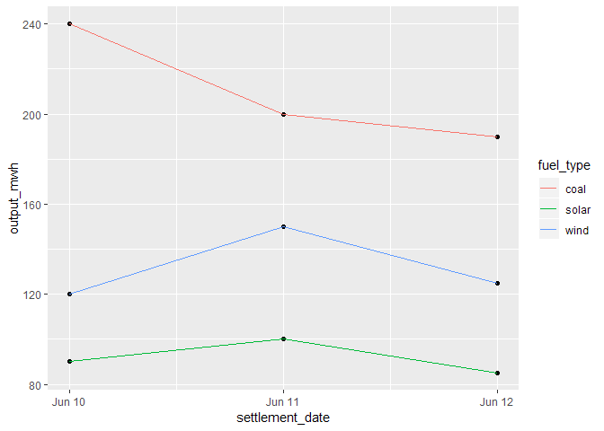

Tidyverse
=========

Adam Rawles

Background
----------

-   What is the tidyverse?
    -   A series of packages created by Hadley Wickham
    -   Used for data analysis and science
    -   All based on an underlying philosophy and structure

Packages
--------

-   tidyr\*
-   dplyr\*
-   stringr\*
-   ggplot2\*
-   tibble
-   readr
-   purrr
-   forcats

Tidy Data
---------

-   A format for datasets
    -   Each variable in a column
    -   Each observation on a row
    -   Separate tables for different "types" of variables
    -   Each related table has a linkable column
-   Why use the tidy data format?
    -   Easier plotting, analysis and manipulation
    -   A common format for all datasets
    -   Models can be easily translated from one dataset to another

Tidy Data (example)
-------------------

    ## # A tibble: 3 x 4
    ##   settlement_date  coal  wind solar
    ##   <chr>           <dbl> <dbl> <dbl>
    ## 1 10 Jun 2018       240   120    90
    ## 2 11 Jun 2018       200   150   100
    ## 3 12 Jun 2018       190   125    85

    ## # A tibble: 9 x 3
    ##   settlement_date fuel_type output_mwh
    ##   <chr>           <chr>          <dbl>
    ## 1 10 Jun 2018     coal             240
    ## 2 10 Jun 2018     wind             120
    ## 3 10 Jun 2018     solar             90
    ## 4 11 Jun 2018     coal             200
    ## 5 11 Jun 2018     wind             150
    ## 6 11 Jun 2018     solar            100
    ## 7 12 Jun 2018     coal             190
    ## 8 12 Jun 2018     wind             125
    ## 9 12 Jun 2018     solar             85

tidyr
-----

-   A package to help with the "tidying" process
-   Two main groups of functions:
    -   Tidying (reshaping)
    -   Value manipulation

tidyr - Reshaping
-----------------

-   gather()
    -   Use this function to convert multiple columns into a key and
        value column
-   spread()
    -   Use this function to convert a key column into multiple columns
    -   Basically the opposite of gather()

gather()
--------

-   gather()
    -   Parameters:
        -   data: the data frame
        -   key: the name of the new "key" column
        -   value: the name of the new "value" column
        -   ...: the columns to be converted

<!-- -->

    ## # A tibble: 3 x 4
    ##   settlement_date  coal  wind solar
    ##   <chr>           <dbl> <dbl> <dbl>
    ## 1 10 Jun 2018       240   120    90
    ## 2 11 Jun 2018       200   150   100
    ## 3 12 Jun 2018       190   125    85

gather()
--------

    untidy_data <- tribble(~settlement_date, ~coal, ~wind, ~solar,
                        "10 Jun 2018", 240, 120, 90,
                        "11 Jun 2018", 200, 150, 100,
                        "12 Jun 2018", 190, 125, 85)

    tidy_data <- gather(untidy_data, key = "fuel_type", value = "output_mwh", coal:solar) #we could also use c(coal, wind, solar)

    tidy_data

    ## # A tibble: 9 x 3
    ##   settlement_date fuel_type output_mwh
    ##   <chr>           <chr>          <dbl>
    ## 1 10 Jun 2018     coal             240
    ## 2 11 Jun 2018     coal             200
    ## 3 12 Jun 2018     coal             190
    ## 4 10 Jun 2018     wind             120
    ## 5 11 Jun 2018     wind             150
    ## 6 12 Jun 2018     wind             125
    ## 7 10 Jun 2018     solar             90
    ## 8 11 Jun 2018     solar            100
    ## 9 12 Jun 2018     solar             85

gather() - exercise
-------------------

-   Import the .csv file I sent you
-   Convert it to the tidy data format

tidyr - value manipulation
--------------------------

-   You can also use tidyr to handle missing values, and split or
    concatenate cells
-   Missing values
    -   drop\_na(data, ...) removes all rows with NA in ... columns
    -   fill(data, ...) replaces all NAs with most recent values in
        ...columns
    -   replace\_na(data, replace, ...) replaces all NAs with the values
        in replace in ...columns
-   Split/join
    -   seperate/\_rows(data, col, into, sep) separates values into
        several columns/rows
    -   unite(data, col, ..., sep) unites ...columns into a single
        column with a separator

tidyr - value manipulation example
----------------------------------

    unite(untidy_data, coal, solar, wind, col = "coal_solar_wind", sep = "/",  )

    ## # A tibble: 3 x 2
    ##   settlement_date coal_solar_wind
    ##   <chr>           <chr>          
    ## 1 10 Jun 2018     240/90/120     
    ## 2 11 Jun 2018     200/100/150    
    ## 3 12 Jun 2018     190/85/125

dplyr
-----

-   So now you've got your raw tidy data
-   The next step is data manipulation
    -   aggregate
    -   calculated columns
    -   subset
-   All of these can be done with the dplyr package

dplyr - the pipe %&gt;%
-----------------------

-   The pipe passes the evaluated result of a function on the left of
    the pipe as the first argument to the function on the right
-   Example

<!-- -->

    library(tidyverse)

    sum(c(1,2,3,4)) %>% print()

    ## [1] 10

    "hello" %>% substr(1,2)

    ## [1] "he"

dplyr - the pipe %&gt;%
-----------------------

-   This can be very useful when performing multiple manipulation steps
    -   e.g. grouping, then finding an average, then subsetting, etc.
    -   It also allows you to read from left to right, rather than from
        inside to outside if the function calls were embedded...

<!-- -->

    sum(c(1,2,3,4)) %>% print()

    ## [1] 10

    print(sum(c(1,2,3,4)))

    ## [1] 10

dplyr - the pipe %&gt;%
-----------------------

-   If you don't want the evaulated result to be passed as the first
    argument, you can use a full stop (".") to specify which parameter
    you want the result passed as...

<!-- -->

    2 %>% substr("hello", ., 4)

    ## [1] "ell"

dplyr - aggregate
-----------------

-   summarise()
    -   This is the main aggregation function
    -   Parameters
        -   .data: the data frame to be summarised
        -   ... name-value pairs of summary functions
            -   This defines what type of summary we want to do

dplyr - summarise() example
---------------------------

    output_data <- tibble::tribble(~settlement_date, ~fuel_type, ~output_mwh,
                    "10 Jun 2018", "coal", 240,
                    "10 Jun 2018", "wind", 120,
                    "10 Jun 2018", "solar", 90,
                    "11 Jun 2018", "coal", 200,
                    "11 Jun 2018", "wind", 150,
                    "11 Jun 2018", "solar", 100,
                    "12 Jun 2018", "coal", 190,
                    "12 Jun 2018", "wind", 125,
                    "12 Jun 2018", "solar", 85)

    output_data %>% summarise(output_mean = mean(output_mwh))

    ## # A tibble: 1 x 1
    ##   output_mean
    ##         <dbl>
    ## 1        144.

dplyr - summarise() by group
----------------------------

-   Alone, this functionality isn't particularly powerful
-   However, when you combine with the group\_by() function, you can
    produce more useful summaries
-   The group\_by() function does exactly what it says: it groups the
    values based a key field

<!-- -->

    output_data %>% group_by(settlement_date) %>% summarise(output_mean = mean(output_mwh))

    ## # A tibble: 3 x 2
    ##   settlement_date output_mean
    ##   <chr>                 <dbl>
    ## 1 10 Jun 2018            150 
    ## 2 11 Jun 2018            150 
    ## 3 12 Jun 2018            133.

-   This is similar to the aggregate functions and group by clauses in
    SQL

dplyr - calculated columns
--------------------------

-   Another feature of the dplyr package is the ability to produce
    calculated columns more easily
-   The mutate() function does this for us

dplyr - mutate()
----------------

-   mutate()
    -   Parameters
        -   .data: the data frame to which the column will be added
        -   ...: name-value pairs of expressions. Name will be the
            column name and value will be the calculated value

dplyr - mutate() example
========================

    output_data %>% mutate(cum_output = cumsum(output_mwh))

    ## # A tibble: 9 x 4
    ##   settlement_date fuel_type output_mwh cum_output
    ##   <chr>           <chr>          <dbl>      <dbl>
    ## 1 10 Jun 2018     coal             240        240
    ## 2 10 Jun 2018     wind             120        360
    ## 3 10 Jun 2018     solar             90        450
    ## 4 11 Jun 2018     coal             200        650
    ## 5 11 Jun 2018     wind             150        800
    ## 6 11 Jun 2018     solar            100        900
    ## 7 12 Jun 2018     coal             190       1090
    ## 8 12 Jun 2018     wind             125       1215
    ## 9 12 Jun 2018     solar             85       1300

dplyr - mutate() example
------------------------

-   With a group\_by() clause...

<!-- -->

    output_data %>% group_by(fuel_type) %>% mutate(cum_output = cumsum(output_mwh))

    ## # A tibble: 9 x 4
    ## # Groups:   fuel_type [3]
    ##   settlement_date fuel_type output_mwh cum_output
    ##   <chr>           <chr>          <dbl>      <dbl>
    ## 1 10 Jun 2018     coal             240        240
    ## 2 10 Jun 2018     wind             120        120
    ## 3 10 Jun 2018     solar             90         90
    ## 4 11 Jun 2018     coal             200        440
    ## 5 11 Jun 2018     wind             150        270
    ## 6 11 Jun 2018     solar            100        190
    ## 7 12 Jun 2018     coal             190        630
    ## 8 12 Jun 2018     wind             125        395
    ## 9 12 Jun 2018     solar             85        275

dplyr - exercise
----------------

-   Using your tidied data set...
-   Create a new column of the next value (lead()), grouped by
    consumption/generation
-   Summarise the dataset (your choice of function) by settlement date

stringr
-------

-   We won't go into much detail here today
-   stringr is a package for string manipulation
-   It uses the regex language (which stands for regular expression) in
    its functions
    -   This language allows us to search for very specific character
        patterns
-   TL;DR Use this package if you ever need to search for text or for an
    expression

ggplot2
-------

-   ggplot2 is a powerful graphing package
-   It's based on a philosophy called The Grammar of Graphics
    -   A plot is made up of a number of parts
        -   The data, and its mapping to the plot area (which data goes
            on the X and which data goes on the Y)
        -   Geometric objects (do we want to use lines, or bars, or
            points, or whatever)
        -   The scales, titles, legends, etc (often collectively termed
            "scale")
    -   The data and the geometric objects together form a layer, and a
        plot can have many layers

ggplot2 - layer
---------------

-   To create a layer, we need a data set, our mappings, and our objects
-   To do this, we employ ggplot2's hierarchical structure
-   First, we start with the ggplot() function where we define our
    dataset and optionally your aesthetics...

<!-- -->

    ggplot(data = output_data, aes(x = settlement_date, y = output_mwh))

ggplot2 - layer
---------------

    ggplot(data = output_data, aes(x = settlement_date, y = output_mwh))

-   Here, we've defined our data set and our aesthetics (our mappings),
    but no geometric object
-   From this, we could create any type of graph we want

ggplot2 - layer
---------------

-   To add a geometric object, we use the appropriate geom\_x function
    for the plot we want...

<!-- -->

    ggplot(data = output_data, aes(x = settlement_date, y = output_mwh)) + geom_point()

-   The geom\_point function inherits from our ggplot call, so it knows
    what dataset and X and Y values we want
-   And that's a layer completed

ggplot - structure
------------------

-   In the previous example, we only had 1 layer
-   In some cases however, you may want many layers with different
    aesthetic mappings (particularly if you're grouping)
-   By default, each geometric object function inherits the parameters
    of our ggplot call, but you can define additional aesthetics very
    easily...

<!-- -->

    ggplot(data = output_data, aes(x = settlement_date, y = output_mwh)) + geom_point() + geom_line(aes(color = fuel_type))

ggplot - structure
------------------

-   Because of how inheritance works in ggplot2, we could produce
    exactly the same graph with...

<!-- -->

    ggplot(data = output_data) + geom_point(aes(x = settlement_date, y = output_mwh)) + geom_line(aes(x = settlement_date, y = output_mwh, color = fuel_type))

-   But clearly one is easier to read than the other...

ggplot2 - structure
-------------------

-   ggplot2 separates out the values and the type of plot you're
    producing (the geometric object)
-   This means you can easily change the look of your graph without
    changing the underlying data
-   However, some geometric objects can only accept certain aesthetic
    mappings...

<!-- -->

    ggplot(data = output_data) + geom_histogram(aes(x = output_mwh))

    ## `stat_bin()` using `bins = 30`. Pick better value with `binwidth`.

-   There's no Y value for a histogram, so supplying one would give an
    error

ggplot2 - exercise
------------------

-   Using your tidy data, produce a plot including a grouping variable

ggplot2 - scales
----------------

-   The default scales in ggplot2 are usually pretty good
-   However, there will always be aspects that you want to change
-   To change a scale, we use the scale\_x\_datatype functions...

<!-- -->

    ... + scale_x_continuous()
    ... + scale_x_date()
    ... + scale_x_discrete()

ggplot2 - scales
----------------

-   Each of these scale\_x\_datatype function accept slightly different
    parameters, but there are some common ones...
    -   name; character string with the scale title
    -   breaks; a vector of the scale breaks
    -   labels; a vector of character strings the same length as breaks
    -   limits; a two value numeric vector
    -   expand; a two value numeric vector

ggplot2 - exercise
------------------

-   Change some aspect(s) of both of the scales on your plot

ggplot2 - themes
----------------

-   In ggplot2, we can add themes to our plots
-   This changes some of the less important graphical features of the
    graph
    -   the plotting background color
    -   the font
    -   the gridlines
    -   the text rotation
    -   the text size
-   Currently, I've got a theme\_elexon(), but it needs some improvement
    so suggestions are welcome

Conclusion
----------

-   The tidyverse is a collection of packages to help with data
    manipulation
-   Use tidyr for cleaning, dplyr for manipulation, and ggplot2 for
    plotting
-   All packages use a common philosophy, pioneered by Hadley Wickham
-   All packages are open source, and very well documented on Github
