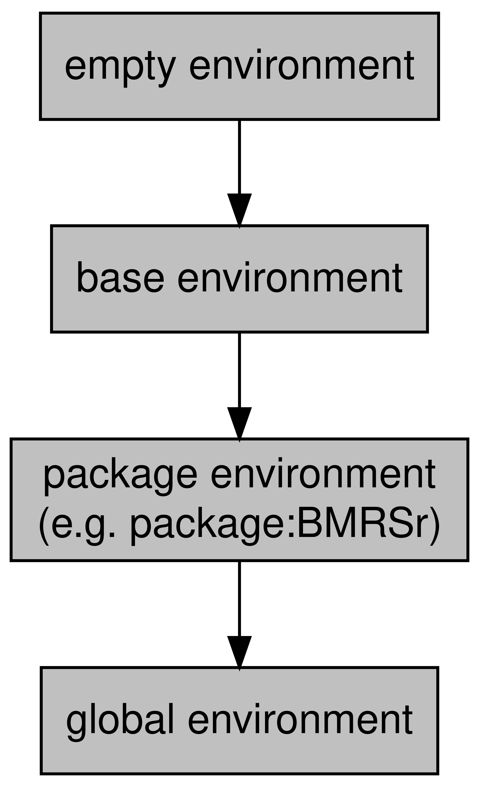

```{r include = FALSE}
if(!knitr:::is_html_output())
{
  options("width"=56)
  knitr::opts_chunk$set(tidy.opts=list(width.cutoff=56, indent = 2), tidy = TRUE)
  knitr::opts_chunk$set(fig.pos = 'H')
}
```

# For Teachers

Now we have a basic understanding of some of the core concepts in R, let's have a look at them in a bit more detail. In contrast to the previous section, here were going to focus on the underpinnings of R. You can kind of think of this section as being less practical and more theoretical.

Previous experience in different programming language will definitely help you, but it's not mandatory. We're going to take a look at some core programming concepts in the next few sections, and the explanations here should be more than enough. If you do have experience in other languages, then these sections will hopefully outline some of the idiosyncrasies of R that make it different to other languages.

If you're going to teach R, this section will provide you with a good level of understanding. Hopefully, you'll not only know *how* to do something when asked, but *why* you should do it that way.

## Functions {#functions-teachers}

In the "For Students" section, we looked at what a function is and how to use one. In this section, we're going to look more at the structure of a function and how you might go about writing your own functions.

When you start writing our own functions, you'll start to see a massive improvement in your efficiency. By extracting out common tasks to functions and by keeping your functions simple, you can easily expand and debug your project. A rough rule of thumb is that if you've copied some code more than twice, think about extracting it out to a function. 

Let's take a look at an example of where it may be appropriate to shorten your workflow by using a function. Let's say you've got 2 datasets, and you want to get the standard deviation and mean of one column and then create a normal distribution based on those values:

```{r}
dataset1 <- data.frame(
  observation_number = c(1,2,3,4,5),
  value = c(10,35,13,20,40)
)
dataset2 <- data.frame(
  observation_number = c(1,2,3,4,5),
  income = c(100,200,150,600,900)
)
```

Without using functions, our workflow might look like this:

```{r}
mean_ds1 <- mean(dataset1$value)
sd_ds1 <- sd(dataset1$value)
normal_dist_ds1 <- rnorm(1000, mean = mean_ds1, sd = sd_ds1)

mean_ds2 <- mean(dataset2$income)
sd_ds2 <- sd(dataset2$income)
normal_dist_ds2 <- rnorm(1000, mean = mean_ds2, sd = sd_ds2)
```

This isn't too bad, but what if we wanted to add another dataset? We'd have to copy and paste the code yet again. Then, say we wanted not to use the mean but the median, we'd have to replace each call to the `mean()` function with `median()` in each block of code.

If we extract out the commonalities to a function, then not only do we reduce the amount of code we're using, but this also makes future changes or fixes much easier.

We'll look more specifically out how we create functions in the next few sections, but for now let's imagine what we'd want our function to look like.
It'd need to calculate the mean and standard deviation of a column, but that column name or position in the dataframe might change - the column is called 'value' in the first dataset but is called 'income' in the second, and even though they're both the second column in the dataset, we don't want to rely on that in case we have a new dataset where the column we want to use isn't in that position.

Let's revisit this once we understand how we create functions in R a bit better. If you're comfortable with creating functions in R, then you can skip to the [solution](#example-function).

### Creating functions

R and its packages give you access to hundreds of thousands of different functions, all tailored to perform a particular task. Despite this wide array to choose from however, they will always be cases where there isn't a function to do exactly what you need to do. For those of you coming over from Excel, this can often be a serious source of frustration where there isn't an Excel function for you to use and there isn't an easy way to create one without knowing VBA.

R is different. Creating functions can be very simple and will really change the way you work.

Creating functions will also highlight an important delineation. Previously, we've been focusing on *calling* functions. Calling a function is essentially using it. But in order to call a function, it needs to be *defined*. Base functions are already defined (i.e. someone has already written what the function is going to do), but when you're creating your own functions, you are *defining* a new function that you're presumably going to call later on.

#### Function structure

If we go back to the beginning of this chapter, we learned that everything that exists is an object. Functions are no exception, and so we create them like we do all our other objects. There is a slight diversion however. When we define a function, we assign it to an object with the `function` keyword like this:

```{r}
my_first_function <- function() {}
```

Notice how we've got two sets of brackets here. The first (`()`) is where we define our input parameters. The second (`{}`) is where we define the body of our function.

Let's do a simple example. Let's create a function that adds two numbers together:

```{r}
my_sum_function <- function(x, y) {
  x + y
}
```

So in this example, I've defined that when anyone uses the function, they need to provide two input parameters named `x` and `y`. Something that people tend to struggle with is that the names of your input parameters have no real *meaning*. They are just used to reference the value provided in the body of the function and, hopefully, make it clear what kind of thing the user of the function should be providing. This is why in some functions that require a dataframe there will be an input parameter called `df` or similar. It can suggest at a glance that the value required for that parameter is a data frame. But just calling it `df` alone has no impact.

In the body of the function, we can see that we're just doing something really simple: we're adding `x` and `y` together with `+`.

Once I've run the code to **define** my function, I can then **call** it like I would any other function:

```{r}
my_sum_function(x = 5, y = 6)
```

##### Optional input parameters

When defining your function, you can define optional parameters. These will likely be values where most of the time you need it to be one thing, but there are edge cases where you need it to be something else. Defining optional parameters is really easy; whenever you define your function, just give it a value and that will be its default:

```{r}
add_mostly_2 <- function(x, y = 2){
  x + y
}

add_mostly_2(x = 5)

add_mostly_2(x = 5, y = 3)
```

Sometimes you'll want to provide users with a set of options. To do so, provide a default value of a vector and use the `match.arg()` function like this:

```{r}
greet_me <- function(greeting = c("hello", "welcome")) {
  greeting <- match.arg(greeting)
  greeting
}
```
This will ensure that users of the function can only provide one of the values in the vector. If they use the default, then the first value in the vector will be used:

```{r}
greet_me("welcome")
greet_me()
```

```{r, error = TRUE}
greet_me("wassup") # This will error because 1 wasn't an options for y
```

**Note:** The `match.arg()` function only works with character vectors.

##### Input validation

Unlike some other languages, functions do not have a specific data type tied to each input parameter. Any requirements that are imposed on an input parameter (e.g. it should be numeric) are done by the function creator in the body of the function. So for instance, when you try to sum character strings, the error you get occurs because of type-checking in the body of the function, not when you provide the input parameters.

```{r, error = TRUE}
function_without_check <- function(x, y) {
  x + y
}
function_without_check(x = 2, y = "error for me please")
```

```{r, warning = TRUE}
function_with_check <- function(x, y) {
  if (!is.numeric(x) || !is.numeric(y)) {
    warning("x or y isn't numeric. Returning NA")
    NA_integer_
  } else {
    x + y
  }
}
function_with_check(x = 2, y = "warn me please")
```

#### Missing Inputs

When you're defining your input parameters, you can define optional parameters (i.e. they have a default value), or required parameters (i.e. they don't have a default value). However, these 'required' parameters aren't really strictly required for two reasons that we'll look at now.

##### Lazy evaluation

What happens if you define a required input parameter (i.e. it doesn't have a default value), but then you don't use it? Do we see an error, or does R carry on like normal?

Let's have a look:

```{r}
use_me_please <- function(x, y, w) {
  x + y
}

use_me_please(x = 1, y = 2)
```

As you can see, we don't get an error. This is due to something called **lazy evaluation**. Lazy evaluation just means that objects don't get evaluated until they're actually used. This is in contrast to strict or direct evaluation, in which objects are evaluated before they're called.

##### `missing()`

There is a programmatic way of checking whethere something is missing. The `missing()` function will return a logical value defining whether the argument was provided with a value:

```{r}
missed_that_one <- function(x) {
  missing(x)
}
missed_that_one()
missed_that_one(1)
```

Personally, I try and stay away from using this approach in my functions. By not providing a default value, a user will need to more closely read your documentation to know if they actually have to provide a value to your function. If instead you assign your parameter a default value (such as `NA` or `NULL`) however, then the user knows for sure that that parameter isn't required for the function to work. Most developers nowadays take a similar approach - make a required parameter required when is it actually required - but this isn't a universal practice so be aware.

#### ...

You'll notice a crucial distinction between R's `sum()` function and ours. The base function allows for an indeterminate number of input parameters, whereas we've only allowed 2 (`x` and `y`). This is because the base `sum()` function uses a `...`. This `...` is essentially shorthand for "as many or as few inputs as the user wants to provide". To use the `...`, just add it as in an input parameter:
```{r,eval=FALSE}
dot_dot_dot_function <- function(...) {
  .
  .
  .
}
```

The `...` works particularly well when you might be creating a function that *wraps* around another one. A wrapping function is just a function that makes a call to another one within it, like this:

```{r}
sum_and_add_2 <- function(...){
  sum(...) + 2
}
```

All we're basically doing in the above wrapping around the `sum()` function to add some specific functionality.

By using the `...` here, we can just pass everything that the user provides to the `sum()` function. This means we don't have to worry about copying any input parameters.

#### Return values

As I mentioned in the "For Students" section, functions have a single return value. By default, a function will return the last evaluated object in the function environment. In our `my_sum_function` example, our last evaluation was `x + y`, so the output of that was what was returned by the function.

You can also be explicit with your return values by using the `return()` function. The `return()` function will return whatever is provided to the `return()` function. This can be useful if you want to return a value prematurely:

```{r}
early_return_function <- function(x,y, return_x  = TRUE) {
  if (return_x) {
    return(x)
  }
  x + y
}
early_return_function(x = 2, y = 10, return_x = TRUE)
```

Here, we can see more clearly that `x` is returned when `return_x` is TRUE and `x + y` is returned otherwise.

Certain style guides suggest that you should **only** use `return()` statements for early returns. In other words, the "normal" return value for your function should be defined by what's evaluated last. Personally, I think you should use whatever makes it clearer for you. I quite like seeing explicit `return()` values in a function because I find it makes it clearer what all the possible return values are, but this is just personal preference.

### Functions as objects

Functions are technically just another object. This means that you can use functions like you would any other object. For instance, some functions will accept other functions as an input parameter. When we move onto the `apply` logic, the `lapply()` (list-apply) function requires a `FUN` parameter that is the function the be applied to each value in the provided list.

```{r}
sum_list <- list(
  c(1,2),
  c(5,10),
  c(20,30)
)

lapply(sum_list, FUN = sum)
```

Linked with the idea that functions are just another type of an object, there is an important distinction between 
`substr`
and
`substr()`. The first will return the `substr` *object*. That is, not the result of applying inputs to the `substr` function, but the function itself. If you just type the name of the function into the console, it will show you the code for that function (it's definition): 

```{r}
substr
```

Conversely, `substr()` will *call* the `sum` function with the inputs provided in the brackets.

```{r}
substr("hey there", 1, 3)
```


#### Anonymous functions

Because some functions accept functions as an argument, there is the concept of **anonymous functions** in R. These are just functions that haven't been assigned a name. For example, we might want to use an anonymous function in an `lapply` call:

```{r}
lapply(sum_list, FUN = function(x) max(x) - min(x))
```
Anonymous functions mean that you don't have to define your function in the traditional way. However, if you're going to use that function more than once, it's advisable to extract it out to a named function and then reference it:

```{r}
diff <- function(x) {
  max(x) - min(x)
}
lapply(sum_list, FUN = diff)
```

### Example function

Going back to our [previous example](functions-teachers) of when we might want to make a function, what might our function actually look like? Recapping, we know we need to calculate the mean and standard deviation of a column, but that the name of the column might change. Using what we've just learnt, let's have a go:

```{r}
create_norm_dist_from_column <- function(dataset, column_name, n = 1000) {
  ds_mean <- mean(dataset[[column_name]])
  ds_sd <- sd(dataset[[column_name]])
  rnorm(n = n, mean = ds_mean, sd = ds_sd)
}

normal_dist_ds1 <- create_norm_dist_from_column(dataset1, "value")
normal_dist_ds2 <- create_norm_dist_from_column(dataset2, "income")

head(normal_dist_ds1, 5)
```

Now, instead of copying the code each time we need it, we've extracted the common computations to a function and then we call the function where we need. Hopefully this demonstrates the logic behind why functions can be so useful.

This is an example of the concept of abstraction, which is a common theme in programming. If you're interested in learning more about abstraction, the [opeRate](https://operate.arawles.co.uk) book that I wrote to turn the understanding you've hopefully built up over this book into actual data analysis skills looks at abstraction in more detail.


### Vectorised functions

An important concept in R that differs from non-functional programming language is the presence of vectorised functions. Vectorised functions operate a bit like applying a set of values to a function over and over again without needing to use iterative loops (which we'll look at later). For example, if we use the `substr()` function as an example, which creates a substring from a string, we can provide a vector of values to the `x` parameter instead of a single value and we'll get a return value for each one:

```{r}
substr(c("hello", "there"), start = 1, stop = 4)
```

Logically, this is quite easy to wrap your head around. R has just applied the same parameters (`start = 1, stop = 4`) to two different strings. In fact, when you provide a single value, you're still providing a vector, it just has a length of 1, so R just applies it once.

This makes repeating functions for multiple values much easier, because you don't need to write any loops or `apply` statements.

#### Recycling

Things get a bit more complicated when you provide vectors to multiple arguments though. For example, what would happen if I provided `stop = c(4,3)` as a parameter to the above function call?

Make your guesses...

```{r}
substr(c("hello", "there"), start = 1, stop = c(4,3))
```
R has used the first value in each vector for the first time it runs (`hello` and `4`), and then it's used the second values from each vector when it runs the second time. What about the `start` parameter though? Well because it's only got a length of 1 but the other parameters have a length of 2, the 1 gets **recycled** until it's the same length as the other parameters. If the length of the larger vector isn't a multiple of the smaller one, then the smaller vector is recycled until it's the same length and any extra values are discarded. So the above example is the same as:

```{r, eval = FALSE}
substr(c("hello", "there"), start = c(1,1), stop = c(4,3))
```
This idea of repeating an operation again and again is very common in programming, and it's something that we'll look at in more detail in the [Iteration](iteration) chapter.

### Questions {#questions-functions-teachers}

1. How are `mean()` and `sum()` different in their implementation of `...`?
2. If functions are objects, how would you construct a function that returns a function? What might be a use for this?
3. Look at the `ellipsis` package. What issue does this package look to solve?
4. What issues might arise when passing `...` to multiple functions inside your function?
5. How could you solve these issues using the `do.call()` function?
6. Why might one use the `missing()` approach instead of assigning a default value? What are the drawbacks of this?

## Environments 

As your scripts become more complex, the number of variables and functions that you assign will start to increase. Pair this with the fact that you may be using lots of external packages that will all contain lots of functions and the number of objects you're working with can easily get into the hundreds and even thousands.

This presents a scoping issue: If I refer to the object `x`, what `x` do I mean if there's more than one? In other words, in which scope should R search for the `x` object?

R uses environments to solve this issue. Environments are collections of objects that can be used to group similar objects and provides a replicable naming convention for retrieving objects that may have the same name from the appropriate environment.

In this chapter, we're going to understand the concepts underpinning environments and scope in R.

### Environment basics

At its core, an environment is a collection of objects. A bit like a list, environments store multiple objects in a single structure.

To create a new environment, we use the `new.env()` function.

```{r}
new_env <- new.env()
```

To add items to our environment, we can add them like we would a list using the `$` operator:

```{r}
new_env$first_object <- "hello"
```

To list all of the objects in an environment, we use the `ls()` function:

```{r}
ls(new_env)
```

Importantly, you can't have two objects in the same environment with the same name. If you try, you'll just overwrite the previous value:

```{r, error = TRUE}
new_env$first_object <- "world"
new_env$first_object
```
### Environment inheritance

Environments have parents and children. In other words, there is a hierarchy of environments, with environments being encapsulated in other environments while also encapsulated other environments.

Every environment (with the exception of what we call the empty environment) has a parent. For example, when I created my `new_env` environment before, this was created in the **global environment**. The global environment is the environment that objects are assigned to when working in R interactively. The global environment's parent environment will be the environment of the last package you loaded. Packages have environments to avoid name conflicts with functions and to help R know where to look for a function. These package environments will contain everything that the package developer included with the package (i.e. functions, maybe some datasets, etc.).

At the top of the environments of packages you've loaded will be the **base environment** which is the environment of base R. Finally, the base environment's parent is the **empty environment** which does not have a parent.


The hierarchy of these environments looks like this:

```{r, echo=FALSE, fig.cap="Environment hierarchy", out.width = "50%", fig.align = "center"}

```

### Scope

So we know that objects in the same environment can't have the same name, but what happens when two different environments happen to have objects with the same name? This is where the concept of **scope** comes in. **Scoping** is the set of rules that governs where R will look for a value.

R will search for the object in order of environment, starting at the most specific environment (so the global environment in the above diagram) and moving up. For example, we know that there is a function in base R called `sum()`. But, if I define a new function in the global environment called `sum` then which function will be called when I type `sum(...)`. Well, because we know that the search path starts from the most specific environment, R will look for `sum` in the global environment first and it'll find the `sum` that I've just defined. At this point, it'll stop looking because `sum` has been found.

For this reason, it's a good idea to use a package like `conflicted` to  manage the packages you loaded, otherwise which function you use when you have two functions with the same name from different packages will be defined by which one you loaded later.

Alternatively, you can specific with which environment R should look for a particular function by prefixing the function with its package and `::`. For example, if I decided against my better judgement to define a function called `sum` in my environment, and then I wanted to call the base function, I could do so like this:

```{r}
base::sum(1,2)
```

### Function environments

Functions, when they are called, create their own more specific environment. The parent of this environment will be the environment in which it was called (most often this will be the global environment).

This breeds some specific behaviours. For example, say you've written a function that expects two input parameters, `x` and `y`. Well, what would happen if someone had already defined an `x` and `y` variable in their script? Which value should R use?

Let's see what happens.

```{r}
sum_custom <- function(x,y) {
  x + y
}

x <- 10
y <- 5

sum_custom(x = 1, y = 2)
```

In this case, the fact that there is already an `x` and `y` in the global environment doesn't really make much difference. The function creates its own more specific environment when it's called, and it looks for the `x` and `y` variables in here first. It finds them and uses those values (1 and 2).

But what happens if a variable doesn't exist in the more specific function environment? Let's take a look.


```{r}
sum_custom <- function(x,y) {
  x + y + w
}

w <- 5

sum_custom(x = 1, y = 2)
```

In this case, the function looks in the specific environment for `w`, but it doesn't exist. The only objects that exist in the function environment are the `x` and `y` that we've provided. So when R doesn't find it in the more specific environment, it looks in the less-specific global environment. It finds it, and so it uses the value it finds.

This can be a dangerous thing, so always make sure that you're function is accessing the values you think it is.

So does R work the other way? Does it ever look in a more specific environment? Nope. 

```{r, error = TRUE}
sum_custom <- function(x,y){
  im_a_sneaky_variable <- 10
  x + y
}

im_a_sneaky_variable
```

Once the function is called, objects in its environment are inaccessible. The long and short of it is, R will start from specific environments and then look upwards, never downwards.

### Mutability

Linked with the idea of function environments is mutability. An object is either mutable or immutable. If it is mutable, then it can be edited from within a function environment. If an object is immutable, then it can't. This might seem like an arbitrary distinction, but it has important consequences. If an object is mutable, then calling the same function on that object twice in a row is going to provide different results (because the object will have changed after the first call). If an object is immutable, then calling the same function on the same object will always return the same value.

In R, values are immutable. In other words, when you pass an object to a function, that function operates on a **copy** of the object you provided - the object is not changed in place.

You can replace the value you passed to the function by assigning it to the returned value:

```{r}
x <- 1
x <- x + 1
```

But this hasn't changed the original value of `x`. It's actually just changed the binded value - you've created a new one and told `x` to be of that value now, you haven't changed the original value.

For the most, this exact distinction isn't too important. The important thing to remember is that when you pass an object to a function, **you are operating on a copy of the object, not the original**.

#### 'Super' assignment

There will be occasions, however, when you need to make changes to the global environment regardless of what environment you are currently in. For instance, say you want to increment a counter every time a function is called, regardless of where it's called from. In these cases, you can use the `<<-` operator. This is used as an assignment operator to assign a value to the global environment. Observe...


```{r}
sum_custom <- function(x,y) {
  count <<- count + 1
  x + y
}

count <- 0

sum_custom(1,2)

count

sum_custom(2,3)

count
```
Note how when we assign `0` to our `count` variable outside of the function, we don't need to use `<<-`. This is because we're already assigning to the global environment.

Use the `<<-` with care and only assign something to the global environment if you really need to. Otherwise, you may start overwriting variables in your global environment without ever realising it.

### Questions {#questions-environments}

1. In what situations can we have two environments with the same name? Why is this?
2. Search 'namespacing'. How does that concept relate to environments?
    + Hint: This is heavily related to question 1
3. What might be an issue with create a function that uses superassignment on an object with the name `x`?

## Objects and Classes

Objects and classes are a fairly ubiquitous concept across programming languages and data analysis tools. We'll briefly look at what an object is in R, but by no means is this an exhaustive description.

### What is a class?

The world is complicated. Everything in the world is unique and defined by an infinite number of properties and features. For example, if you take a person, they can be defined by their name, where they're from, where their parents are from, their hair colour, their likes and dislikes, and so on and so on. When we want to store data in a structured and formal way in a computer system, however, this isn't particularly helpful. Instead, we need to store data in a predefined structure. This is essentially what an class is; a pre-defined structure to store important attributes or features of a **thing**.

Let's take the person instance again. Let's say we're going to store data on a number of individuals, we won't be able to store everything about them. So we'll choose a subset of their attributes or features to store that are relevant to what we need. But to make things more efficient, we're going to store the same information for each one. So lets say we're going to do some geographical analysis, we might want to include a person's name, their nationality, and perhaps their ethnicity. So for each person we want to store, we can store these three attributes. And we might call this data structure a "person". Well this is exactly what an class is; a collection of attributes and features that is shared objects instances of the same type.

So our class is "person", and it has the attributes "name", "nationality", and "ethnicity". Now this obviously doesn't capture everything about a person, but it's enough for what we want to do.

Graphing that object might look something like this:

```{r echo=FALSE, fig.cap="Example `Person` object", out.width = "50%", fig.align = "center"}
knitr::include_graphics("./diagrams/objects.png")
```

### What is an object?

An object is just an instance of a class. So if you create a person from our "person" called John, then "John" is the object an "person" is the class.

When you create a dataframe for example, you're creating a `data.frame` object from the basic structure of the `data.frame` class.

### Objects and Classes in R

Looking more specifically at R, what kind of objects do we see. Well, according to John Chambers, the founder of the S programming language upon which R is based, everything is:

> "To understand computations in R, two slogans are helpful:   
>
>  *  Everything that exists is an object.
>  *  Everything that happens is a function call.
>
> --- John Chambers"

So every function, dataframe, plot, list, vector, integer, everything is an object.

To see the class of an object in R, use the `class()` function.

```{r}
class(data.frame()) # here we're finding the class of an empty data.frame
class(data.frame) # here we're finding the class of the data.frame() function
class(1)
```

#### Inheritance

Sometimes, different classes are interrelated. For example, if you were storing data on vehicle, then you might have a "vehicle" class. But if you're storing data on lots of different vehicles, you might also have classes for each type of vehicle (e.g. "car", "motorbike", etc.). All of these classes are still vehicles, and so you don't want to have to repeat yourself when you define each of those classes. In other words, all of those classes are going to have some common attributes like colour, horsepower and so on. Similarly, each different type of vehicle will have some attributes that are unique to that type of vehicle. For instance, motorbikes can have sidecars but vans and cars don't. Cars and vans have doors but motorbikes don't. This highlights the benefits of inheritance. By creating a "vehicle" class and allowing your subsequent classes to inherit all of the attributes of the "vehicle" class, you can avoid duplication while allowing distinct classes. This way, when you want to add any attributes to all of your vehicles, you can just do it via the "vehicle" class rather than changing each type of vehicle class.

Diagramming this relationship:

```{r echo=FALSE, fig.cap="Example of inheritance using cars", out.width = "50%", fig.align = "center"}
knitr::include_graphics("./diagrams/inheritance_cars.png")
```

Inheritance is an extremely deep topic which we won't go into here, but R objects also use inheritance. To see the inheritance tree of an object, use the `is()` function:

```{r}
is(1L)
```
Diagramming this like our "vehicle" example would look like this:

```{r echo=FALSE, fig.cap="Inheritance of the integer class", out.width = "20%", fig.align = "center"}
knitr::include_graphics("./diagrams/inheritance_numeric.png")
```

Here we can see that an integer object is made up of the integer, double, numeric classes. The order of inheritance goes from left to right so we know that the integer class inherits from the double class, which inherits from the numeric class.

#### Object-Oriented Systems

Unfortunately (or fortunately, depending on your point of view), R doesn't have a single way of storing objects. In fact, there are 2 object-oriented (OO) programming systems in base R, and more (like R6) can be added via packages. These two base OO systems are S3 and S4, and they differ in the way that objects are constructed, stored, and interacted with. We're not going to go into the difference here, but I recommend Hadley's [Advanced R](https://adv-r.hadley.nz/) to better understand the difference between the two. For now, I'm just going to explain the basics of the S3 system as I think it's the easiest to understand and helps convey the philosophy behind why we use objects more easily.

##### S3

In the S3 system, we rely on generic functions and methods. Generics are functions that have a single common goal, but that can be used for objects that might be very different. For example, `print()`-ing a dataframe is going to be different to `print()`-ing a plot or an API response or whatever. But `print()` always seems to know what to do. The reason it does is that the `print()` function is a **generic** function that actually uses a more specific function to achieve it's goal. In other words, we achieve a fairly high level goal like printing by calling a function that is specific to the object we're working on under the hood. These more specific functions are called **methods**.

As a real world analogy, think of the process of talking to someone. The common goal in talking is to communicate. But, depending on the language that someone speaks, the actual act of talking is going to be slightly different for different people you talk to. In this case, you can think of **communicating** as being the **generic** - it's the eventual goal. And **talking in the appropriate language** as being the **method**.

Going back to R, if you type `print.` into the console, the autocompleter will show you lots and lots of `print.something()` functions. These are all of the **methods** for all of the different printable objects in R. `print.date()` will print a date object, `print.data.frame()` will print a dataframe object and so on. But when you just use the `print()` function on an object, R will automatically choose which method it needs for the object you've passed as an input parameter. If there isn't a specific method for the object you've provided, then it will use the default `print.default()` method.

```{r}
# here we're using the generic
print(as.Date("2020/06/10")) 
# because we're printing a Date object,
# this is the method that is actually used
print.Date(as.Date("2020/06/10"))
```
If an object inherits multiple classes, then R will look for the correct method starting from it's most specific class. So for example, if an object has classes `c("class_1", "class_2")`, then R would look for `print.class_1()` and only look for `print.class_2()` (and then `print.default()`) if it couldn't find `print.class_1()`.

While you can often tell if something is an S3 method by it being a generic followed by a `.` and then an object name, don't rely on this, because people often use `.` to separate words in functions that can make them look like S3 methods when they're not. 

**Note:** In some languages, methods are essentially functions or sub-routines that are tied to an class. For instance, a class that represents a person's bank account might have the method `Balance()`, which will return how much money a person has in their account. There are certainly some similarities between how methods are used in R and some other languages, they are a bit different. Mainly, in R, methods are not attributes of a class but are separate functions.

### Creating classes

The obvious question is "Can I make my own class in R?". The answer is yes. And quite easily too. Whether you should or not is a different story. We're just going to look very briefly at creating a class in using S3 for now, but I'd recommend Hadley's [Advanced R](http://adv-r.had.co.nz/) for a deeper look at the different systems and how to use them.

#### Class attribute

In S3, the class of an object is defined by its `class` attribute, which stores a vector of class names. To see an object's class, we use the `class()` function:

```{r}
class(1)
class(TRUE)
```
This class attribute will determine what method is dispatched when we call a generic on this object. So here, if we called `print()` on `1`, then it would look for `print.numeric()` and dispatch that method to print the object. Technically, this just calls `print.default()` because the default method knows how to print numeric values but the logic remains.

Something which will make OO programmers everywhere cringe, is that the class attribute for an R object is modifiable:

```{r}
var_1 <- 1
class(var_1) <- "custom_class"
class(var_1)
```
Now, when we attempt to print the `var_1` variable, R will look for the appropriate method based on it's class (`custom_class`), which would be `print.custom_class()`. In this case, a `print.custom_class` method doesn't exist, so it'll default to the `print.default()` method:

```{r}
print(var_1)
```

Importantly, we've learnt here that setting the class of an object is as easy as using the `class()` function and the `<-` operator.


#### Constructor functions

To ensure our objects in the same class all have a similar structure, we want to make a constructor function that requires certain values. For example, let's create a class to store addresses, and we'll say that we need the house name, the road and the city. Our constructor function might look like this:


```{r}
address <- function(house_name, road, city) {
  address <- list(
    house_name = house_name,
    road = road,
    city = city
    )
  class(address) <- "address"
  return(address)
}
```
Now to create an object from my constructor function, I just need to use the `address()` function:

```{r}
my_address <- address("4", "Pleasant Drive", "London")
class(my_address)
```

Now, if I called `print(my_address)`, R would look for a `print.address()` method. But, it wouldn't find one and so would turn to `print.default()` which would print our object like any other list. Therefore, we might want to write our own method to print our new object how we want to.

#### Creating methods

To create a method, all we need to do is create a function with the name of our generic followed by a '.' and then name of our class. So from our previous example, our method would look like this:
```{r}
print.address <- function(address) {
  cat("The house name is: ", address$house_name, "\n")
  cat("The road is: ", address$road, "\n")
  cat("The city is: ", address$city, "\n")
}
```

Now when we call `print()` on our new object, it will find the `print.address()` method and use that to print our object:
```{r}
print(my_address)
```

#### Creating generics

You can also create your own generic functions for your classes. Generic functions have a very simple structure. Let's say we want to create a new generic called `post`:

```{r}
post <- function(x) {
  UseMethod("post")
}
```
This is just telling R that when the `post()` function is called on an object, look for the appropriate `post` method to use. Without us writing any methods, this would be useless because R wouldn't have any methods to use!

Let's create a default method that can be applied if we don't have a more specific class:

```{r}
post.default <- function(x){
  cat("Your object is now in the post! Expect it in 5 to 10 weeks")
}
```
In our example, this default method isn't going to be very useful but it demonstrates that we need a default method to be dispatched if we haven't written a specific method for that object class.

Let's write a method for our `address` object:
```{r}
post.address <- function(x) {
  cat("Your object has been posted to ", x$house_name, " ", x$road, " ", x$city, "!")
}
```

Now, if we call our new generic on two different classes of object and compare:

```{r}
post(1)
post(my_address)
```
We can see that in the top example, `post()` has dispatched the `post.default()` method. In the second example though, it's dispatched the `post.address()` method.

As you can see, the S3 system is quick and easy. For smaller projects, this should be more than enough to get you by. Because it's quick and easy though, it's not particularly sturdy. You can change the class of any object, which will change the methods that are called on it and so can really mess things up. If you're careful though, creating custom objects in your projects can be very powerful.

### Questions {#questions-objects-and-classes}

1. Why does `is(1L)` return integer, then double, then numeric in that order?
2. Now we understand inheritance, why can dataframes be subsetted with a `$`?
3. If we create a dataframe and then call `print.default()` on it, why do we get the output that we do? Why does it look more like a list than a dataframe?
4. Why are constructors not a fool-proof way of making sure that all our objects of our class will have the same structure? How else might one create an object of class `address`?
5. `methods("mean")` returns methods for dates and datetimes, but no other object. Why is this? What does this mean when constructing methods for a new generic?

## Expressions

When we use R, we write code which is then passed to the console to be executed (evaluated). Before the code is executed though, it is just an **expression**.

An expression can therefore be defined as a section of R code that has not yet been fully evaluated. That does not mean that all expressions have to be *valid*. For example, a piece of code like this `mean()` is a valid expression, but will error when it is evaluated because `mean` is missing its required arguments.

Expressions themselves are made up of 4 constituent parts: calls, constants, names and pairlists. For now though, we're not going to look at the bits that make up expressions, but instead we'll focus on expressions as a whole.

### Creating expressions

Creating an expression (an unevaluated piece of code) is done in base R using the `quote()` function. Unfortunately, the `expression()` function in R doesn't actually create an expression in the sense we're talking about, so use `quote()` instead.

When creating single line expressions, you can just provide the expression directly within the `quote()` function:

```{r}
quote(x + 10)
```

When providing multiple line expressions, wrap the argument in `{}` like this:

```{r}
quote({
  x + 10
  y - 5
})
```

Unfortunately, testing whether something is an expression in R isn't that easy, because the base R functions are made for the constituent parts of the expression (e.g. `is.call()`, `is.name()`, etc.). Instead, you can use the `is_expression()` function from the `rlang` package to test whether something is an expression:

```{r}
rlang::is_expression(
  quote(1 + 1)
)
```

### Evaluating expressions

Once you've created your expression, you can evaluate it using the `eval()` function:
```{r}
my_expr <- quote(1 + 1)
eval(my_expr)
```

Of course in this example, this is essentially just the same as `1 + 1` as we're evaluating the expression in the same environment in which it was created. However, the `eval()` function accepts an `envir` parameter where you can pass an environment for the expression to be evaluated in:

```{r, error = TRUE}
new_environ <- new.env()
new_environ$num <- 10
my_expr <- quote(num + 5)
eval(my_expr) # this will error because num doesn't exist in our parent environment
eval(my_expr, new_environ) # this won't error because num exists in new_environ
```
Using this, you can create expressions in one environment without evaluating them, and then evaluate them later in different environments to where they were created.

### Substitution

As well as hard coding in the objects and names in our expression, we can substitute in values from our environment. For example, lets say we wanted to create an `x <- y + 1` expression, but we wanted to change what the value of `y` was when we created it. We could acheive this by using the `substitute()` function. `substitute()` requires two parameters, `expr` which must be an expression, and `env` which must be an environment or a list and contains the objects you want to substitute.

```{r}
substitute(x <- y + 1, list(y = 1))
```

As you can see, this doesn't *evaluate* the expression, it simple substitutes the provided names with the values provided in the `env` parameter. This can be a really powerful tool for building up expressions.

### Quasiquotation

A related subject to expressions and substitution is the idea of **quasiquotation**, used heavily in the `tidyverse` packages. Quasiquotation is the process of quoting (creating expressions) and unquoting (evaluating) parts of that expression.

A good example of quasiquotation in action is the `dplyr` package. Within the `dplyr` package functions, you'll provide column names to various analysis and data manipulation functions. When you provide those names however, you provide them as raw names (i.e. not in quotation marks): `dplyr::mutate(data, new_column = old_column + 1)`. Those column names are then quoted (as in `quote()`) and then evaluated in the context of the dataset that you've provided:

```{r}
test_df <- data.frame(col_1 = c(1,2,3))
eval(quote(col_1), env = test_df)
```

I won't go into quasiquotation here because [Hadley's chapters on the subject](https://adv-r.hadley.nz/quasiquotation.html) in his Advanced R book summarises the topic much better than I ever could. But if you're interested, I would recommend using the `tidyverse` packages and trying to understand how quoting and unquoting has been implemented in those packages. If you can get your head round it and even implement similar ideas in your own projects, you can greatly expand your flexibility and efficiency.

### Questions {#questions-expressions}

1. Why might an expression like this `fun(x)` be useful? Particularly, when paired with `substitute()`.
2. What's the difference between
```{r, eval = FALSE}
quote({
  x <- 1
  x + 10
})
```
and

```{r, eval = FALSE}
list(
  quote(x <- 1),
  quote(x + 10)
)
```
Why do they evaluate to different things?

## If / Else

Building on our logical operators, there will often be times where you want to split the logic of your code depending on a criteria. For example, if you've created a function that can accept a character string or a number, you might want to split the body of the function to do something slightly different depending on the class of the provided argument.

If / else statements in R has a simple structure:
```{r, eval = FALSE}
if (criteria_statement) {
  what_you_want_to_do
} else if (other_criteria) {
  something_else_you_want_to_do
} else {
  something_you_want_to_do_if_all_else_fails
}
```

Putting this into practice, a real If / else block may look like this:

```{r}
x <- 1
if (x == 1) {
  return("x is 1")
} else if (x == 2) {
  return("x is 2")
} else {
  return("x is not 1 or 2")
}
```

Implementing this in a function could look like this:

```{r}
what_is_it <- function(x) {
  if (is.character(x)) {
    return("x is a character")
  } else if (is.numeric(x)) {
    return("x is numeric")
  } else {
    return("x is something else")
  }
}

what_is_it("hello")
what_is_it(2)
what_is_it(TRUE)
```

### Questions {#questions-if-else}

1. Rather than writing `if (x == 1 | x == 2 | x == 3)`, how could you use the `%in%` operator to make it shorter?
2. How does the `switch()` function relate to if / else statements?

## Iteration

Functions are an important stepping stone in reducing the amount of code you need to do something (they make your code less **verbose**). Another tool in acheiving this goal is the idea of iteration. Iteration is just the process of doing something more than once.

We'll often find ourselves doing the same thing again and again in programming. Calculating the means for lots of different columns, or different datasets, or making plots for different groups are all examples of operations that you'll rarely only do once. There are two approaches to this: imperative programming and functional programming. First, we'll take a look at imperative programming (for loops) as this is more akin to lots of other programming language. Later, however, we'll look at how we can better utilise the fact that R is a functional programming to solve some iteration problems more easily and with fewer errors.

### Imperative programming

Imperative programming is a programming paradigm that focuses on *how* an operation should be performed. For instance, if you wanted to add up all the numbers in a vector with an imperative approach, you would create a loop to go through and add each number to a grand total. You've clearly defined (with a control stucture like a loop) how the operation should be performed. Imperative programming languages have the benefit that understanding exactly what is happening is much easier. You can follow the flow of logic and what's happening at each stage. Imperative languages are very common and you will inevitably have heard of some of the more famous languages that are based on imperative programming:

* Ruby
* Python
* C++
* C
* Java

 Central to an imperative programming language are its control stuctures. Control structures define the order of execution and although the exact control structures that are supported in each language change, a fairly universal control structure is the for loop.

#### For loops

For loops are almost completely ubiquitous across different programming languages. They allow us to perform actions over a list or set of objects. They are flexible and explicit even if they can be difficult to understand. A simple for loop in R follows a simple structure:

```{r, eval = FALSE}
for (identifier in list) {
 do_something_with_it(identifier)
}
```

In the above, the identifier is used to access the value that is currently being iterated upon. Let's look at a practical example:

```{r}
for (i in c(1,2,3)) {
  print(i)
}
```
In this loop, we go through the vector of values 1, 2 and 3, and we print it using the `i` identifier that we've assigned to the value we're currently iterating upon. So the code inside the loop will run three times (once for each value in the vector we've provided). The first time, `i` will equal 1. The code will execute, and then `i` will take the value of 2 and so on.

This isn't a particular useful example. Let's look at more realistic example. Let's say you've got a list with 2 dataframes in that have the same structure:

```{r}
dataframe_list <- list(
                    data.frame(
                      obs = c(1,2,3),
                      value = c(10,11,9)
                     ),
                     data.frame(
                      obs = c(1,2,3),
                      value = c(100,200,150)
                     )
                   )
```
And you want to calculate the mean for the `value` column for each one:

```{r}
for (df in dataframe_list) {
  mean(df$value)
}
```

Or, if we refer back to our [function example](#example-answer) from the Functions chapter, we could apply our function to each dataset to get a normal distribution for each. Rather than just printing those numbers, we'll also construct a list to store the output:

```{r}
output_list <- list()
for (df in seq_along(dataframe_list)) {
  output_list[[df]] <- create_norm_dist_from_column(dataframe_list[[df]], "value")
}
head(output_list[[1]], 5)
```

In this case, rather than looping through the *values* in the `dataframe_list` list, we're looping through the *indices* using `seq_along()`. `seq_along()` just creates a vector with all the indices in. So for a list with two values in it, this is *almost* equivalent to `1:2`.
Using the `seq_along()` approach lets us keep track of where we are in the `dataframe_list`, as we know exactly how many times the loop as run at any given time, so we can assign the output to the right position in `output_list`.

**Note:** If you can avoid expanding a list (i.e. increasing the size of a list by one everytime to add to it), then this is preferable. However, for very small lists, expanding a list rather than pre-defining its size and filling those values isn't really a big deal.

#### While loops

While loops are closely related to for loops. Instead of looping through an object or through the indices of an object, a while loop runs when a criteria is fulfilled:

```{r}
x <- 0
while(x < 2) {
  x <- x + 1
  print(x)
}
```

### Declarative and functional programming

For loops and its derivatives are very powerful, but they are arguably less important in functional languages like R than they are in other languages purely imperative languages like C and Python.

Instead, within R we can leverage functions to wrap the loops. This means that we can spend less time writing exactly how something should be done and focus on what we want out of it. By using functions to move away from writing out for loops, we start to shift paradigms from the *imperative* to the *declarative*. With imperative programming, you define *how* things should happen. With declarative programming, you focus more on the *what* you want to happen. For example, let's look back at our `dataframe_list` example.  We can turn our loop into a function that we can call whenever we have a list of dataframes:

```{r}
norm_dists <- function(dfs, column = "value") {
  output_list <- list()
  for (df in seq_along(dfs)) {
    output_list[[df]] <- create_norm_dist_from_column(dfs[[df]], column)
  }
  output_list
}

head(
  norm_dists(dataframe_list)[[1]], 1
)
```
Now, whenever we have a list of dataframes we can just use our `norm_dists()` function and provide the column name to the `column` parameter. We don't need to write a new for loop for our new datasets, we can just apply them to our function. We've moved from the imperative (exactly what should happen to calculate each distribution) to the declarative (give me the normal distribution and I'm not bothered how you do it). Although we haven't actually changed how the normal distribution is created, we have changed how we get that distribution.

Declarative programming in R is very closely related to the idea of vectorized functions, which we looked at the in [Functions](#vectorised-functions). Vectorised functions abstract away the complexities of writing imperative code but they still utilise control stuctures at their core.

#### Declarative vs Imperative

It's not really a case of one approach being better than the other, and in R you'll often find yourself using both. In my personal experience, I relied heavily on imperative paradigms when I started using R because it made more sense to me. Then gradually as I became more familiar with how R worked at its core, I began to move to using more declarative approaches and the `apply` functions which we'll look at next. But I never forgot that this functional approach was still relying on imperative programming at its core.

So my advice if you're new to R is to use both. Write out for loops *and* learn how to create and use functions to the same end. That way you'll always have the right tool for the job and you'll be more able to apply your knowledge to new languages in the future.

#### Applying functions

Because of its importance in R, applying multiple values to the same function and keeping track of the output has bred its own functions and methodology. More specifically, it's led to the development of the `apply` set of functions. These act as syntactic sugar to decrease the number of for loops present in your code\*.

\* A common argument is that `apply` functions are faster than for loops. Generally speaking, this is not true. Most times the function is just an implementation of a for loop at its core, meaning the `apply` functions aren't more efficient or faster. Instead, the benefit comes from the readability and cleanliness of the code.

We've already seen an example of the `lapply` (list-apply) function in [action](#functions-as-objects), but lets do another one. Let's say we have a list of vectors containing numbers and we want the maximum for each.

```{r}
number_list <- list(
                  c(1,2,3,4),
                  c(500,250,100,10),
                  c(1000,1001,1001,1000)
                )
```

We can apply the `max()` function to each item in our list:
```{r}
lapply(number_list, FUN = max)
```

As you can see, this is much shorter than writing out a for loop to acheive the same goal. 

Another function is the `apply` family is `sapply()` that will attempt to simplify its output. Using the previous example and the `sapply()` function, we get a vector instead of a list:

```{r}
sapply(number_list, FUN = max)
```

The `FUN` parameter for this set of functions accepts any function object (including anonymous functions), meaning that we can apply any function we like to each item in our list.

#### purrr

The `apply` family of functions in base R are extremely powerful. However, they are not quite as user-friendly as one might have hoped, and there are some inconsistencies across the different `apply` functions. To solve this, the `purrr` provides the `map()` functions to provide the same functionality but in a more succinct and universal way.

Personally, I do prefer the `purrr` functions to the base R functions as I find they're easier to learn to use, however the base R functions do provide the same functionality. Documentation for the `purr` package can be found at [https://purrr.tidyverse.org](purrr.tidyverse.org).

### Questions {#questions-iteration}

1. In what situation would you use `i in x` over `i in seq_along(x)`?
2. Why is `seq_along(x)` preferable to `1:length(x)`?
3. What would be the for loop code that would be required to replicate `lapply(number_list, FUN = max)`? Which would be easier to debug?
